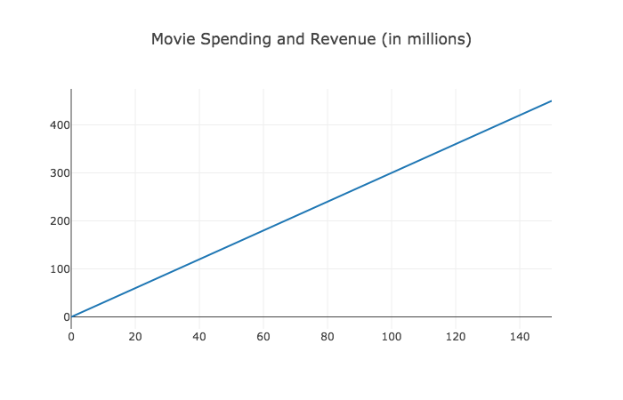
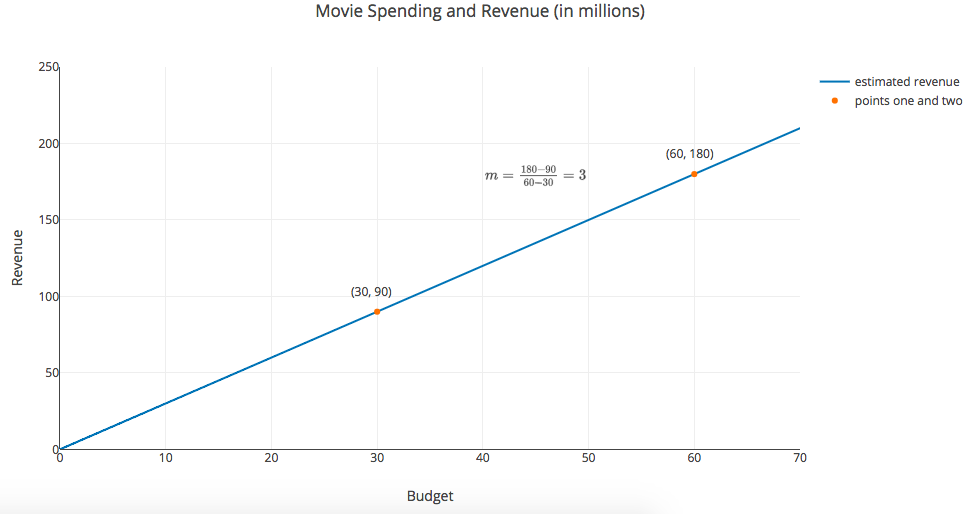
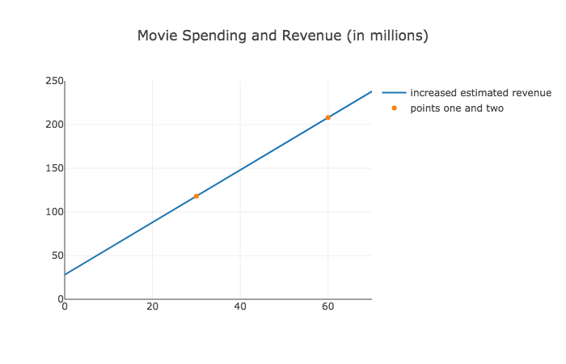

# Calculating a line

### Learning Objectives

* Understand how to calculate the slope variable for a given line
* Understand how to calculate the y-intercept variable for a given line

### Introduction

Previously, we saw how a regression line can help us describe our relationship between an input variable like a movie budget and an output variable like the expected revenue from a movie with that budget.  Let's take a look at that line again. 



We also showed how we can describe a line with the formula $y = mx + b $, where $m$ is the slope and $b$ is the y-intercept of the line.  One of the benefits of representing our line as a formula is that we then can calculate the $y$ value of our line for any input of $x$.


```python
def y(x):
    return 3*x + 0 

y(0)
```


```python
y(60000000)
```

We know what these $m$ and $b$ values represent.  However, we still need to learn how to derive these values from an input line.  

### Calculating the slope variable 

Say the following are a list of points along a line.

| X       | Y            | 
| ------------- |:-------------:| 
| 0      |0 | 
| 30       |90  | 
| 60       |180  | 

How do we calculate the slope $m$ given these points along the line?  

This is the technique.  We can determine the slope by taking any two points along the line and looking at the ** ratio of the vertical distance travelled to the horizontal distance travelled**.  Rise over run.

Or, in math, it's:

$m = \frac{\Delta y}{\Delta x }$
> The $\Delta$ is the capitalized version of the Greek letter Delta.  Delta means change.  So you can the read the above formula as $m$ equals change in $y$ divided by change in $x$.

Let's take another look of our graph and our line.  Let's look at $x$ equal to zero and $x$ equal to 30 million.  Plugging the numbers into our formula, we see that the slope between those two points is:


* $\Delta x$ = 30 
* $\Delta y$ = 90 
* $\frac{\Delta y}{\Delta x} = \frac{90}{30}  = 3$

In other words, change in $x$ means our ending $x$ value minus our starting $x$ value and change in $y$ means our ending $y$ value minus our $y$ initial $y$ value .  

Therefore, we can describe our $\Delta y$ and $\Delta x$ as the following: 

* $\Delta y = y_1-  y_0$
* $\Delta x = x_1 - x_0$

where $y_1$ is our ending point's $y$ value, $y_0$ is our initial point's $y$ value and $x_1$ and $x_0$ are our ending and initial $x$ values, respectively.   

**Altogether**, we can say $m$ is the following: 

> given a beginning point $(x_0, y_0)$ and an ending point $(x_1, y_1)$ along any segment of a straight line, the slope of that line $m$ equals the following:  

> $$m = \frac{(y_1 - y_0)}{(x_1 - x_0)}$$

Now, let's apply this formula to our line.  We can choose any two points along a straight line to calculate the slope of that line.  So we now choose the second and third points in our table:

* our initial point (30, 90)
* our ending point of (60, 180)  

Then plugging these coordinates into our formula, we have the following:

> $m =\frac{(y_1 - y_0)}{(x_1 - x_0)} =  \frac{(180 - 90)}{(60 - 30)} = 90/30 = 3$



So that is how we calculate the slope of a line.
>  Rise over run. Take any two points along that line and divide distance travelled vertically from the distance travelled horizontally.    Change in $y$ divided by change in $x$.

### Calculating y-intercept

Now that we know how to calculate the slope, let's turn our attention to calculating the y-intercept.  

For example, look at the line below.



If you look at the far-left of the x-axis you will see that our $y$ value no longer is 0 when $x$ is 0.  So we should calculate the value of our y-intercept, $b$.  Here's what we can do.  

**First, let's figure out the slope of our line.**  Once again, we can choose any two points on the line to do this.  So we choose the points (60, 208) and (30, 118).  Plugging this into our formula for $m$ we have:  

> $m =\frac{(y_1 - y_0)}{(x_1 - x_0)} =  \frac{(208 - 118)}{(60 - 30)} = 90/30 = 3$

Ok, now we plug in our value of $m$ into our formula: 

$y = 3x + b $

Now to solve for $b$, we need to fill in values for $y$ and $x$. 

It turns out we have lots of values for $y$ and $x$ to fill in.  Any $y$ and $x$ value along the line can be used.  For example, we can see from our line that when x = 30, y = 118.  Let's plug that into our formula and solve for $b$: 

> $ 118 = 3 * 30 + b $

> $ 118 = 90 + b $

> $ 28 = b $

Solving for $b$, we see that $b$ = 28.  So now we have filled in our $m$ and $b$ variables for our line, and can describe our blue line above by the formula $y = 3x + 28 $.  Or in code it looks like: 


```python
def y(x):
    return 3*x + 28
```

Let's see how well we did by providing a value of $x$, and seeing if the $y$ value lines up to the $y$ value of the line in our chart.


```python
y(20)
```

When plugging an $x$ value of 20 million into our formula, we see that $y$ equals 88 million.  Let's look at our graph above and compare this result to the $y$ value where $x$ is 20 million.  It seems we did a good job of getting the slope by calculating $m$ and using an $x$ and $y$ value pair to solve for the y-intercept.  

### Summary

In this lesson, we saw how to calculate the slope and y-intercept variables that describe a line.  We can take any two points along the line to calculate our slope variable.  This is because given two points along the straight line, we can divide the change in $y$ over those two points by the change in $x$ over those two points to get the slope.  Then we can take that slope ($m$), pick a point along the line, plug that point's $x$ value and $y$ value into the $y = mx + b$ formula, and finally use algebra to solve for $b$ to discover the y-intercept.
