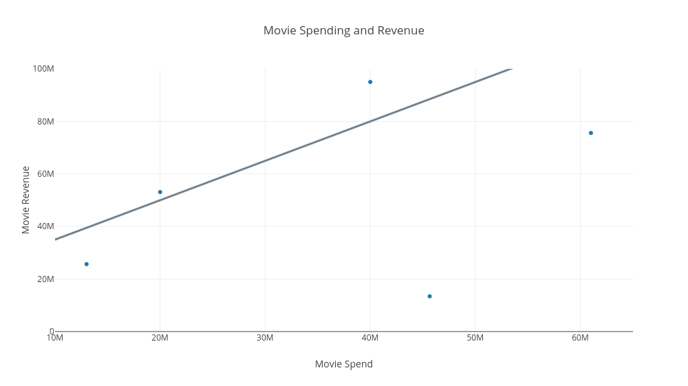

# Calculating a line

### Learning Objectives

* Understand how to calculate the slope variable for a given line
* Understand how to calculate the y-intercept variable for a given line

### Introduction

Previously, we saw how a regression line can help us describe our relationship between an input variable like a movie budget and an output variable like the expected revenue from a movie with that budget.  Let's take a look at that line again. 


We also showed how we can describe a line with the formula $y = mx + b $, where $m$ is the slope and $b$ is the y-intercept of the line.  One of the benefits of representing our line as a formula is that we can then calculate the $y$ value of our line for any input of $x$.


```python
def y(x):
    return 3*x + 0 

y(0)
```


    0


```python
y(60000000)
```


    180000000


Now that know what these $m$ and $b$ values represent.  However, we still do not know how to derive these values from an input line.  That is what we'll cover in this lesson. 

### Calculating the slope variable 

Let's say the following are a list of points along a line.

| X       | Y            | 
| ------------- |:-------------:| 
| 0      |0 | 
| 30 million      |40 million | 
| 60 million      |80 million | 

How do we calculate the slope $m$ given those points along the line.  This is our technique.  Take any two points along a straight line, and the slope $m$ between those two points is **the ratio of the vertical distance travelled to the horizontal distance travelled**.  Or, in math, it's:

$m = \Delta y \div \Delta x $
> The $\Delta$ is the capitalized version of the Greek letter Delta.  In math, delta means change.  So you can the read the above formula as $m$ equals change in $y$ divided by change in $x$.

For example, let's take another look of our graph, and our line.  Let's travel the distance from $x$ being equal to zero to 30 million.  Plugging the numbers into our formula, we see that the slope between those two points is:

* $\Delta x$ = 30 million
* $\Delta y$ = 40 million

Notice that another way to word change in $x$ is really to say it's our ending $x$ value minus our starting $x$ value.  Similarly, change in $y$ means our ending $y$ value minus our $y$ initial $y$ value .  

So, we can describe our $\Delta y$ and $\Delta x$ as the following: 

* $\Delta y = y_1-  y_0$
* $\Delta x = x_1 - x_0$

where $y_1$ is our ending point's $y$ value, $y_0$ is our initial point's $y$ value and $x_1$ and $x_0$ are our ending and initial $x$ values, respectively.   

So putting this altogether, we can say $m$ is the following: given a beginning point $(x_0, y_0)$ and an ending point $(x_1, y_1)$ along any segment of a straight line, the slope of that line $m$ equals the following:  

$m = (y_1 - y_0) \div (x_1 - x_0)$

Ok, let's apply this formula to our line.  Because we can choose any two points along a straight line to calculate the slope of that line, we can now choose the second and third points in our table (30,000,000, 40,000,000) as our initial point, and an ending point of (60,000,000, 80,000,000). Then plugging these coordinates into our formula, we have the following:

* $m =(y_1 - y_0)\div(x_1 - x_0) =  (80,000,000 - 40,000,000) \div (60,000,000 - 30,000,000) = 4/3 = 1.33$


So that is how we calculate the slope of a line, take any two points along that line and divide distance travelled vertically from the distance travelled horizontally.  Rise over run.  Change in $y$ divided by change in $x$.

### Calculating y-intercept

Now, not only can we calculate our slope variable given two points along the line, but we can also calculate our y-intercept.  For example, take a look at a new line, the line in the graph below.



If you look at the far-left of the x-axis you will see that our $x$ values do not start at zero, but at 10 million.  In other words, we do not directly see our the value of $y$ when $x$ is zero.  But doesn't mean we can't calculate the value of our y-intercept, $b$.  

Here's what we can do.  First, let's figure out the slope of our line.  Once again, we can choose any two points on the line to do this.  So we choose the points (30 million, 66 million) and (40 million, 80 million).  Plugging this into our formula for $m$ we have:  

$m = (y_1 - y_0)/(x_1 - x_0) = (80,000,000 - 66,000,000)/ (40,000,000 - 30,000,000) = 13,000,000 / 10,000,000 $ = 1.3 

Ok, so now plugging our calculated value of $m$ into our formula we have: 

$y = 1.3x + b $

Now the formula is true, for any point (x, y) along the line.  So to solve for $b$, we need to fill in values for $y$ and $x$.  It turns out we have lots of values for $y$ and $x$ to fill in, as any $y$ and $x$ value along the line can be used.  For example, we can see from our line that when x = 40,000,000, y = 80,000,000.  Let's plug that into our formula and solve for $b$: 

$ 80,000,000 = 1.3 * 40,000,000 + b $

So now let's solve for $b$.

$ 80,000,000 = 1.3 * 40,000,000 + b $

$ 80,000,000 = 52,000,000 + b $

$ 28,000,000 = b $

Solving for $b$, we see that $b$ = 28,000,000.  So now we have filled in our $m$ and $b$ variables for our line, and can describe our gray line above by the formula $y = 1.3x + 28,000,000 $.  Or in code it looks like: 


```python
def y(x):
    return 1.3*x + 28000000
```

Let's see how well we did by providing a value of $x$, and seeing if the $y$ value lines up to the $y$ value of the line in our chart.


```python
y(20000000)
```


    54000000.0


So using our formula, when $x$ is 20 million $y$ equals 54 million.  Looking at our graph above, this it seems that our gray line returns a similar $y$ value when $x$ is at 20 million.  We did a good job of first using our formula for $m$ to calculate the slope of a line, and then choosing a value of $x$ and $y$ along the line to solve for the y-intercept.

### Summary

In this lesson, we saw how to calculate the slope and y-intercept variables that describe our line.  We can take any two points along the line to calculate our slope variable.  This is because given two points along the straight line, we can divide the change in $y$ over those two points by the change in $x$ over those two points, and that is the value of our slope.  Then once we have the value for our slope variable, we can take a point along the line and know that our formula satisfy that the $x$ value at that point multiplied by our calculated slope, plus some number $b$ should equal the $y$ value at that point.  So having the $x$, $y$, and $m$ variables for a given point, we can use algebra to solve for our $y$ intercept.  Finally, we turned this formula into a function, 
